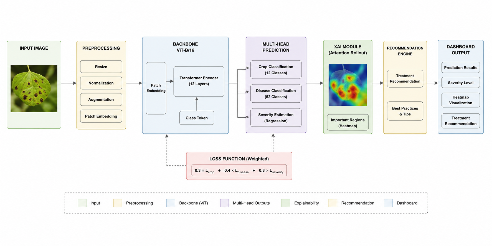

# ViT-Based Smart Plant Health Monitoring System

## Overview
This project presents an advanced **Vision Transformer (ViT)-based multi-task learning framework** for plant disease analysis.  
The system simultaneously performs:

- Crop Classification
- Disease Identification
- Severity Estimation
- Explainable AI Visualization
- Treatment Recommendation

The framework is designed to improve agricultural decision-making by providing both **high accuracy** and **human-understandable explanations**.


## Problem Statement
Traditional plant disease detection systems often suffer from:

- Single-task prediction only
- Lack of explainability
- Poor generalization
- No actionable recommendations
- Difficulty identifying disease severity

This project addresses these limitations using a unified explainable multi-head architecture.


## Objectives

- Develop a unified multi-task deep learning system
- Improve classification accuracy using Vision Transformers
- Integrate Explainable AI (Attention Rollout)
- Estimate disease severity levels
- Generate actionable treatment recommendations
- Build a dashboard-ready inference pipeline


## Dataset

**Dataset:** PlantCity Dataset

### Dataset Statistics
- 10,000+ Images
- 12 Crop Types
- 52 Disease Classes
- Multi-label annotations

### Supported Tasks
| Task | Description |
|---|---|
| Crop Classification | Identify plant type |
| Disease Detection | Predict disease category |
| Severity Estimation | Estimate infection level |

---

## System Architecture




## Proposed Framework

The complete pipeline consists of:

1. **Input Image Processing**
2. **Vision Transformer Backbone (ViT-B/16)**
3. **Multi-Head Prediction Network**
4. **Explainability Module**
5. **Severity Analysis**
6. **Treatment Recommendation Engine**
7. **Dashboard Visualization**


## Model Architecture

### Backbone
- Vision Transformer (ViT-B/16)

### Prediction Heads
- Crop Classification Head
- Disease Classification Head
- Severity Regression Head

### Explainability
- Attention Rollout Visualization

### Composite Loss Function
The model uses a weighted composite loss:

\[
Loss = 0.3L_{crop} + 0.4L_{disease} + 0.3L_{severity}
\]


## Explainable AI Module

The system integrates **Attention Rollout** to visualize disease-focused regions.

### Severity Thresholds
| Severity Score | Level |
|---|---|
| 0 – 0.30 | Mild |
| 0.31 – 0.70 | Moderate |
| 0.71 – 1.00 | Severe |

Benefits:
- Improves trustworthiness
- Helps farmers interpret predictions
- Highlights infected regions visually


## Results

### Model Performance
| Metric | Score |
|---|---|
| ViT Accuracy | 99.55% |
| F1 Score | 99.55% |
| ResNet Accuracy | 98.25% |
| Performance Gain | +1.30 pp |
| Parameters | 85.8M |


## Literature Comparison

| Study | Accuracy / F1 |
|---|---|
| Yang et al. (2024) | Lower than proposed |
| Hemalatha (2024) | Lower than proposed |
| Singha Roy & Kukreja (2025) | Lower than proposed |
| Potharaju et al. (2026) | Lower than proposed |
| **Proposed System** | **99.55%** |

---

## Qualitative Inference Pipeline

The inference workflow includes:

1. Image Upload
2. Preprocessing
3. Feature Extraction
4. Disease Prediction
5. Attention Visualization
6. Recommendation Generation


## Key Contributions

- Unified multi-task framework
- Explainable AI integration
- Severity-aware predictions
- Recommendation engine
- Superior benchmark performance
- Dashboard ready deployment pipeline


## Technologies Used

| Category | Tools |
|---|---|
| Language | Python |
| Deep Learning | PyTorch |
| Model | Vision Transformer (ViT) |
| Visualization | Matplotlib |
| Explainability | Attention Rollout |
| Notebook | Jupyter |

---

## Project Structure

```bash
project/
│
├── data/
├── notebooks/
├── models/
├── outputs/
├── visualizations/
├── utils/
├── README.md
└── requirements.txt
```


## How to Run

### Clone Repository

```bash
git clone <https://github.com/HareemFatima5/ViT-Based-Smart-Plant-Health-Monitoring-System/tree/main>
cd project-folder
```

### Install Dependencies

```bash
pip install -r requirements.txt
```

### Run Notebook

```bash
jupyter notebook
```

Open the notebook file and execute all cells.

---

## Future Improvements

- Real-time mobile deployment
- Edge-device optimization
- Additional crop coverage
- Federated learning integration
- Multi-language farmer dashboard

---

## Contributors

- **Misbah Shaheen** 
- **Hareem Fatima**
  GitHub: [HareemFatima5](https://github.com/HareemFatima5)
- Attiqa Bano: [AttiqaBano](https://github.com/AttiqaBano)
---

## License

This project is licensed under the MIT License.


## Acknowledgments

- PlantCity Dataset Contributors
- Vision Transformer Research Community
- Explainable AI Research Works
