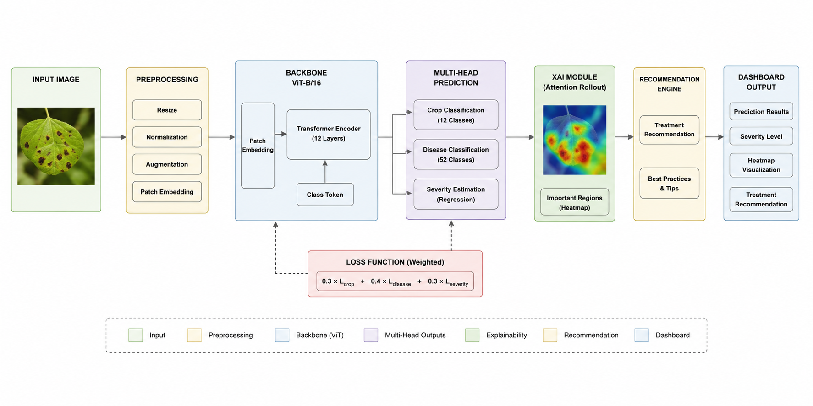

# ViT-Based Smart Plant Health Monitoring System

## Overview

This project presents a Vision Transformer (ViT-B/16) based plant health monitoring system evaluated on the PlantCity dataset — a real field-collected multi-crop leaf disease dataset from Pakistan.

The system performs:
- Multi-class plant disease classification (52 classes)
- Explainable AI visualization via Attention Rollout
- Disease severity estimation using attention maps and HSV leaf segmentation
- ResNet50 CNN baseline comparison

## Problem Statement

Traditional plant disease detection systems often suffer from:
- Lack of explainability
- Poor generalization to real field conditions
- No disease severity assessment
- Single-task prediction only

This project addresses these limitations using a ViT-B/16 transformer with attention-based explainability and a severity estimation pipeline validated on a brand new Pakistani agricultural dataset.

## Objectives

- Establish the first deep learning benchmark on the PlantCity dataset
- Compare CNN (ResNet50) vs Transformer (ViT-B/16) performance on 52-class plant disease recognition
- Integrate Explainable AI via Attention Rollout
- Estimate disease severity levels without additional supervision
- Analyze model calibration using Expected Calibration Error (ECE) and temperature scaling

## Dataset

**Dataset:** PlantCity — A Comprehensive Image Dataset of Multi-Crop Leaf Diseases in Pakistan

Khan, M. S., Nisa, K., Ahmad, I., Zubair, M., & Alshammari, K. (2025). PlantCity: A Comprehensive Image Based on Multi Crop Leaves in Pakistan. *Data in Brief*, 112130. https://doi.org/10.1016/j.dib.2025.112130

### Dataset Statistics

| Property | Value |
|----------|-------|
| Total Images (original) | 10,667 |
| Total Images (augmented pool) | 44,095 |
| Crop Types | 12 |
| Disease Classes | 52 |
| Healthy Classes | 11 |
| Disease Classes | 41 |
| Min Images / Class | 312 (Apricot Blight) |
| Max Images / Class | 1,925 (Tomato Early Blight) |
| Collection Location | Chitral & Charsadda, Pakistan |
| Collection Conditions | Real field environment |

### Crops Covered

Apple, Apricot, Bean, Cherry, Corn, Fig, Grape, Lokat, Pear, Persimmons, Tomato, Walnut

## Data Preprocessing

### Split Strategy

| Split | Source | Images |
|-------|--------|--------|
| Train (85%) | train.zip | 30,866 |
| Validation (15%) | train.zip | 6,614 |
| Test (held-out) | test.zip (separate) | 10,667 |

**Note:** Seed = 42 used for all splits. Test set is fully held out and never seen during training or validation.

**Class Imbalance:** WeightedRandomSampler with weights = 1.0 / class_count

## Model Architectures

### ResNet50 Baseline

- **Pretrained:** ImageNet-1k
- **Frozen:** conv1, bn1, layer1, layer2
- **Custom head:** Dropout(0.4) → Linear(2048, 512) → ReLU → Dropout(0.3) → Linear(512, 52)
- **Total params:** 24,583,796 | **Trainable:** 23,138,868 (94.1%)

### ViT-B/16

- **Pretrained:** ImageNet-21k (via timm v1.0.26)
- **Frozen:** Transformer blocks 1–8
- **Trainable:** Blocks 9–12 + classification head
- **Patch size:** 16×16 | **Embedding dim:** 768 | **Attention heads:** 12
- **Total params:** 85,838,644 | **Trainable:** 28,393,012 (33.1%)

## Training Configuration

| Hyperparameter | ResNet50 | ViT-B/16 |
|----------------|----------|----------|
| Optimizer | Adam | AdamW |
| Learning Rate | 1e-4 | 3e-5 |
| Weight Decay | 1e-4 | 0.05 |
| LR Scheduler | ReduceLROnPlateau | Cosine + 2ep Warmup |
| Label Smoothing | 0.1 | 0.1 |
| Batch Size | 32 | 32 |
| Epochs | 15 | 15 |
| Gradient Clip | 1.0 | 1.0 |

## Results

### Test Set Performance

| Metric | ResNet50 | ViT-B/16 | Δ |
|--------|----------|----------|---|
| Accuracy | 99.58% | 99.61% | +0.03pp |
| Precision (W) | 99.58% | 99.61% | +0.03pp |
| Recall (W) | 99.58% | 99.61% | +0.03pp |
| F1-Score (W) | 99.58% | 99.61% | +0.03pp |
| Best Val Acc | 99.02% | 99.41% | +0.39pp |

### Per-Class Highlights

| Class | ResNet50 F1 | ViT-B/16 F1 |
|-------|-------------|--------------|
| Cherry Shot Hole Disease | 0.94 | 0.99 |
| Grape Anthracnose Leaf | 0.95 | 1.00 |
| Grape Downy Mildew | 0.94 | 0.99 |
| Tomato Early Blight | 0.99 | 1.00 |
| Macro Average (52 cls) | 0.99 | 0.99 |

Both models achieve F1 ≥ 0.94 across all 52 classes. ViT shows strongest advantage on grape and cherry disease subclasses where inter-class visual similarity is highest.

### Model Calibration (ViT-B/16)

| Metric | Value |
|--------|-------|
| ECE before temperature scaling | 8.62% |
| Optimal temperature T | 0.6215 |
| ECE after temperature scaling | 0.09% |
| Improvement | -8.53pp |

## Explainability — Attention Rollout

Attention Rollout propagates information flow from the `[CLS]` token across all 12 transformer blocks by recursively multiplying attention matrices. Tokens below the 90th percentile are discarded before the matrix product. The resulting 14×14 map is bilinearly upsampled to 224×224 for overlay visualization.

**Key findings:**
- Heads 4, 7, 8, 10 concentrate on disease-affected regions
- Heads 1, 5, 6, 9, 11 capture leaf boundary and background structure
- Complementary head diversity provides multi-faceted spatial evidence per prediction

## Disease Severity Estimation

### Pipeline

1. ViT-B/16 forward pass → disease class + confidence
2. Attention Rollout → 224×224 spatial focus map
3. HSV leaf segmentation → isolate leaf from background
4. `severity_score = infected_leaf_px / total_leaf_px`
5. Categorical labelling using two thresholds

### Severity Thresholds

| Score Range | Category | Recommended Action |
|-------------|----------|---------------------|
| < 0.20 | Mild | Monitor; preventive spray |
| 0.20 – 0.50 | Moderate | Targeted treatment required |
| > 0.50 | Severe | Immediate intervention needed |

### Severity Results (200 test images)

| Metric | Value |
|--------|-------|
| Healthy mean severity score | 0.0000 |
| Diseased mean severity score | 0.3000 |
| Separation | +0.3000 |
| Diseased classified as Moderate | 187 / 200 (93.5%) |
| Healthy correctly scored zero | 13 / 200 (6.5%) |

A separation of **+0.3000** confirms that ViT attention maps carry quantitatively meaningful spatial information beyond classification labels, enabling disease staging without additional supervision.

## Key Contributions

- **First benchmark on the PlantCity dataset** — establishes reference baselines for future research on Pakistani crop disease recognition
- **CNN vs Transformer comparison** — ResNet50 and ViT-B/16 perform comparably, suggesting simpler CNNs are viable for deployment
- **Attention Rollout XAI** — spatial interpretability without additional training
- **Severity estimation** — +0.3000 healthy/diseased separation validated on 200 test images
- **Calibration analysis** — ECE reduced from 8.62% to 0.09% via temperature scaling

## Technologies Used

| Category | Tool |
|----------|------|
| Language | Python 3.12 |
| Deep Learning | PyTorch 2.10.0 |
| Transformer Models | timm v1.0.26 |
| Visualization | Matplotlib, Seaborn |
| Explainability | Attention Rollout (custom implementation) |
| Platform | Kaggle (NVIDIA Tesla T4 GPU) |

## System Architecture

## Future Improvements

- Real-time mobile deployment
- Edge-device optimization
- Additional crop coverage
- Federated learning integration
- Multi-language farmer dashboard

---

## Contributors

- **Misbah Shaheen** 
- **Hareem Fatima**
  GitHub: [HareemFatima5](https://github.com/HareemFatima5)
- **Attiqa Bano**
   GitHub: [AttiqaBano](https://github.com/AttiqaBano)
  
---

## License

This project is licensed under the MIT License.

## Acknowledgments

- PlantCity Dataset Contributors
- Vision Transformer Research Community
- Explainable AI Research Works
